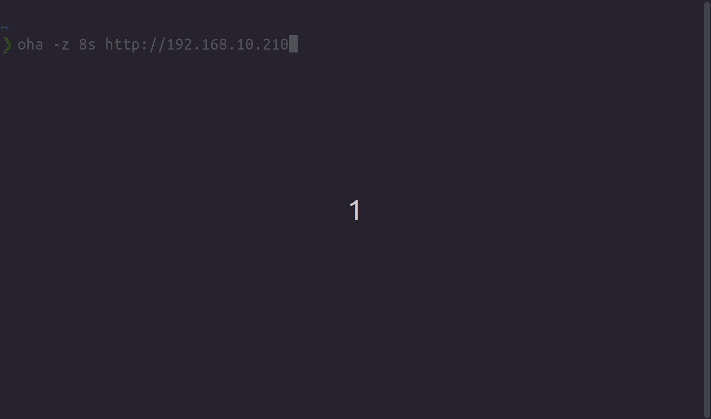

# oha (おはよう)

[](https://github.com/hatoo/oha/actions?query=workflow%3ACI)
[](https://crates.io/crates/oha)

oha is a tiny program that sends some load to a web application and show realtime tui inspired by [rakyll/hey](https://github.com/rakyll/hey).

This program is written in Rust and powered by [tokio](https://github.com/tokio-rs/tokio) and beautiful tui by [tui-rs](https://github.com/fdehau/tui-rs).



# Installation

This program is built on stable Rust.

```bash
$ cargo install oha
```

# Platform

- Linux - Tested on Ubuntu 18.04 gnome-terminal
- Windows 10 - Tested on Windows Powershell
- MacOS - Tested on iTerm2

# Usage

`-q` option works different from [rakyll/hey](https://github.com/rakyll/hey). It's set overall query per second instead of for each workers.

```bash
oha 0.1.0
hatoo <hato2000@gmail.com>
Ohayou(おはよう), HTTP load generator, inspired by rakyll/hey with tui animation.

USAGE:
    oha [FLAGS] [OPTIONS] <url>

ARGS:
    <url>    Target URL.

FLAGS:
        --disable-compression    Disable compression.
    -h, --help                   Prints help information
        --no-tui                 No realtime tui
        --http2                  Only HTTP2
    -V, --version                Prints version information

OPTIONS:
    -A <accept-header>           HTTP Accept Header.
    -a <basic-auth>              Basic authentication, username:password
    -D <body-path>               HTTP request body from file.
    -d <body-string>             HTTP request body.
    -T <content-type>            Content-Type.
    -z <duration>                Duration of application to send requests. If duration is specified, n is ignored.
                                 Examples: -z 10s -z 3m.
        --fps <fps>              Frame per second for tui. [default: 16]
    -H <headers>...              Custom HTTP header.
        --host <host>            HTTP Host header
    -m, --method <method>        HTTP method [default: GET]
    -n <n-requests>              Number of requests to run. [default: 200]
    -c <n-workers>               Number of workers to run concurrently. [default: 50]
    -x <proxy>                   HTTP proxy
    -q <query-per-second>        Rate limit, in queries per second (QPS)
        --redirect <redirect>    Limit for number of Redirect. Set 0 for no redirection. [default: 10]
    -t <timeout>                 Timeout for each request. Default to infinite.
```

# Contribution

Feel free to help us!

Here are some issues to improving.

- Write tests
- Improve tui design.
  - Show more information?
  - There are no color in realtime tui now. I want help from someone who has some color sense.
- Improve speed
  - I'm new to tokio. I think there are some space to optimize query scheduling.
- Mesasure DNS lookup time and dialup time.
- Add an option to disable keep-alive connection.
- Output like CSV or JSON format.
- Improve histogram in summary output
  - It uses very simple algorithm now.
