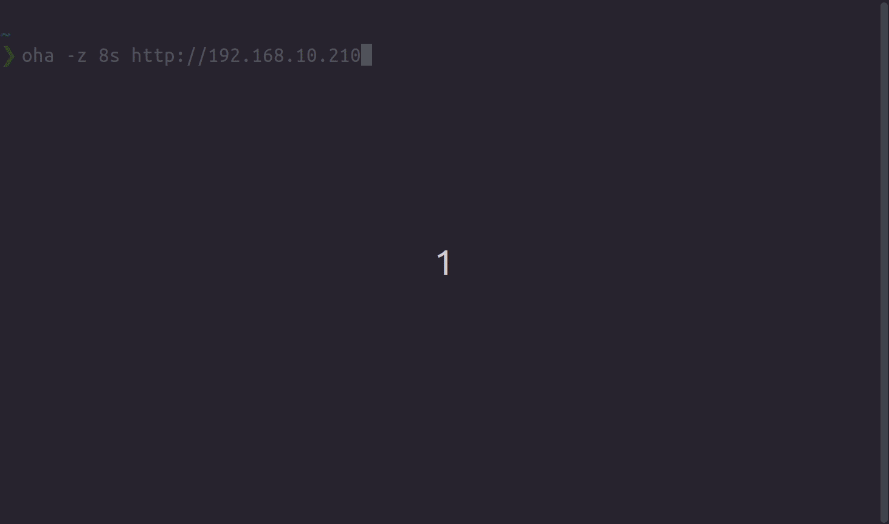

# oha (おはよう)

[](https://github.com/hatoo/oha/actions?query=workflow%3ACI)
[](https://crates.io/crates/oha)
[](https://archlinux.org/packages/extra/x86_64/oha/)
[](https://formulae.brew.sh/formula/oha)

[](https://ko-fi.com/hatoo)

oha 是一个小型程序，用于向 Web 应用发送一些负载，并展示受 [rakyll/hey](https://github.com/rakyll/hey) 启发的实时 TUI。

该程序使用 Rust 编写，并由 [tokio](https://github.com/tokio-rs/tokio) 提供支持，并使用 [ratatui](https://github.com/ratatui-org/ratatui) 展示美观的 TUI。



# 安装

该程序基于稳定的 Rust 构建，通过 Cargo 安装需要 `make` 和 `cmake` 作为先决条件。

```
cargo install oha
```

您可以选择将 oha 构建在 [native-tls](https://github.com/sfackler/rust-native-tls) 上而不是 [rustls](https://github.com/rustls/rustls)。

```
cargo install --no-default-features --features native-tls oha
```

您可以通过启用 `vsock` 功能来启用 VSOCK 支持。

```
cargo install --features vsock oha
```

您可以通过启用 `http3` 功能来启用实验性的 HTTP3 支持。这使用了由 Hyper 开发者提供的 [H3](https://github.com/hyperium/h3/r) 库。
只要 H3 仍处于实验阶段，它就会保持实验性。目前它依赖于使用 rustls 进行 TLS。

## 下载预构建二进制文件

您可以从每个版本的 [发布页面](https://github.com/hatoo/oha/releases) 或每次提交的 [发布工作流](https://github.com/hatoo/oha/actions/workflows/release.yml) 和 [发布 PGO 工作流](https://github.com/hatoo/oha/actions/workflows/release-pgo.yml) 下载预构建的二进制文件。

## 在 Arch Linux 上

```
pacman -S oha
```

## 在 macOS (Homebrew) 上

```
brew install oha
```

## 在 Windows (winget) 上

```
winget install hatoo.oha
```

## 在 Debian ([Azlux's repository](http://packages.azlux.fr/)) 上

```
echo "deb [signed-by=/usr/share/keyrings/azlux-archive-keyring.gpg] http://packages.azlux.fr/debian/ stable main" | sudo tee /etc/apt/sources.list.d/azlux.list
sudo wget -O /usr/share/keyrings/azlux-archive-keyring.gpg https://azlux.fr/repo.gpg
apt update
apt install oha
```

## X-CMD (Linux, macOS, Windows WSL/GitBash)

您可以使用 [x-cmd](https://www.x-cmd.com) 安装。

```sh
x env use oha
```

## 容器化

### 官方 Docker 镜像

[ghcr.io/hatoo/oha](https://github.com/hatoo/oha/pkgs/container/oha)

### 本地构建镜像

您也可以构建并创建包含 oha 的容器镜像

```sh
docker build -t hatoo/oha:latest .
```

然后您可以通过容器直接使用 oha

```sh
docker run --rm -it --network=host hatoo/oha:latest https://example.com:3000
```

## 基于配置文件的优化 (PGO)

您可以通过以下命令使用 PGO 构建 `oha`：

```sh
bun run pgo.js
```

并且二进制文件将位于 `target/[target-triple]/pgo/oha`。

**注意**：请记住，为了运行上述命令，
您需要安装 `cargo-pgo` cargo 包。

您可以通过 `cargo install cargo-pgo` 安装它。

# 平台

- Linux - 在 Ubuntu 18.04 gnome-terminal 上测试
- Windows 10 - 在 Windows Powershell 上测试
- MacOS - 在 iTerm2 上测试

# 用法

`-q` 选项的工作方式与 [rakyll/hey](https://github.com/rakyll/hey) 不同。它是设置总体每秒查询次数，而不是针对每个工作线程。

```sh
Ohayou(おはよう), HTTP load generator, inspired by rakyll/hey with tui animation.

Usage: oha [OPTIONS] <URL>

Arguments:
  <URL>  目标 URL 或包含多个 URL 的文件。

Options:
  -n <N_REQUESTS>
          要运行的请求数量。接受纯数字或后缀：k = 1,000, m = 1,000,000 (例如 10k, 1m)。 [默认值: 200]
  -c <N_CONNECTIONS>
          要并发运行的连接数。对于较大的 `-c`，您可能需要增加对打开文件数量的限制。 [默认值: 50]
  -p <N_HTTP2_PARALLEL>
          在 HTTP/2 上发送的并行请求数量。`oha` 将总共运行 c * p 个并发工作线程。 [默认值: 1]
  -z <DURATION>
          应用程序发送请求的持续时间。
          在 HTTP/1 上，当达到持续时间时，正在进行的请求会被中止并计为“因截止时间而中止”
          您可以使用 `-w` 选项更改此行为。
          当前，在 HTTP/2 上，当达到持续时间时，会等待正在进行的请求。`-w` 选项被忽略。
          示例：-z 10s -z 3m。
  -w, --wait-ongoing-requests-after-deadline
          当达到持续时间时，等待正在进行的请求
  -q <QUERY_PER_SECOND>
          总体查询速率限制，单位为每秒查询次数 (QPS)
      --burst-delay <BURST_DURATION>
          在预定义数量的请求之间引入延迟。
          注意：如果指定了 qps，则会忽略 burst
      --burst-rate <BURST_REQUESTS>
          突发请求的速率。默认为 1
          注意：如果指定了 qps，则会忽略 burst
      --rand-regex-url
          使用 rand_regex crate 生成 URL，但点在此查询中被禁用 例如 http://127.0.0.1/[a-z][a-z][0-9]。当前动态方案、主机和端口与 keep-alive 不能很好地工作。有关语法细节，请参见 https://docs.rs/rand_regex/latest/rand_regex/struct.Regex.html。
      --urls-from-file
          从文件读取要查询的 URL
      --max-repeat <MAX_REPEAT>
          '--rand-regex-url' 的参数。max_repeat 参数给出了 x*, x+ 和 x{n,} 操作符将变成的最大额外重复次数。 [默认值: 4]
      --dump-urls <DUMP_URLS>
          将目标 URL 转储 <DUMP_URLS> 次以调试 --rand-regex-url
      --latency-correction
          校正延迟以避免协调遗漏问题。如果未设置 -q，则忽略此选项。
      --no-tui
          无实时 TUI
      --fps <FPS>
          TUI 的帧率。 [默认值: 16]
  -m, --method <METHOD>
          HTTP 方法 [默认值: GET]
  -H <HEADERS>
          自定义 HTTP 头。示例：-H "foo: bar"
      --proxy-header <PROXY_HEADERS>
          自定义代理 HTTP 头。示例：--proxy-header "foo: bar"
  -t <TIMEOUT>
          每个请求的超时时间。默认为无限。
      --connect-timeout <CONNECT_TIMEOUT>
          建立新连接的超时时间。默认为 5s。 [默认值: 5s]
  -A <ACCEPT_HEADER>
          HTTP Accept 头。
  -d <BODY_STRING>
          HTTP 请求体。
  -D <BODY_PATH>
          从文件读取 HTTP 请求体。
  -Z <BODY_PATH_LINES>
          逐行从文件读取 HTTP 请求体。
  -F, --form <FORM>
          指定 HTTP multipart POST 数据 (与 curl 兼容)。示例：-F 'name=value' -F 'file=@path/to/file'
  -T <CONTENT_TYPE>
          内容类型。
  -a <BASIC_AUTH>
          基本认证 (用户名:密码)，或 AWS 凭证 (访问密钥:私有密钥)
      --aws-session <AWS_SESSION>
          AWS 会话令牌
      --aws-sigv4 <AWS_SIGV4>
          AWS SigV4 签名参数 (格式: aws:amz:region:service)
  -x <PROXY>
          HTTP 代理
      --proxy-http-version <PROXY_HTTP_VERSION>
          连接到代理的 HTTP 版本。可用值 0.9, 1.0, 1.1, 2。
      --proxy-http2
          使用 HTTP/2 连接代理。相当于 --proxy-http-version=2
      --http-version <HTTP_VERSION>
          HTTP 版本。可用值 0.9, 1.0, 1.1, 2, 3
      --http2
          使用 HTTP/2。相当于 --http-version=2
      --host <HOST>
          HTTP Host 头
      --disable-compression
          禁用压缩。
  -r, --redirect <REDIRECT>
          重定向次数限制。设置 0 表示不重定向。HTTP/2 不支持重定向。 [默认值: 10]
      --disable-keepalive
          禁用 keep-alive，防止在不同 HTTP 请求之间重用 TCP 连接。HTTP/2 不支持此功能。
      --no-pre-lookup
          *不* 在开始时执行 DNS 查找以缓存它
      --ipv6
          仅查找 ipv6。
      --ipv4
          仅查找 ipv4。
      --cacert <CACERT>
          (TLS) 使用指定的证书文件验证对等方。即使指定了此参数，也会使用本机证书存储。
      --cert <CERT>
          (TLS) 使用指定的客户端证书文件。必须同时指定 --key
      --key <KEY>
          (TLS) 使用指定的客户端密钥文件。必须同时指定 --cert
      --insecure
          接受无效证书。
      --connect-to <CONNECT_TO>
          使用类似 'example.org:443:localhost:8443' 的字符串覆盖 DNS 解析和默认端口号
          注意：如果对同一 host:port:target_host:target_port 多次使用，将随机选择
      --no-color
          禁用配色方案。 [环境变量: NO_COLOR=]
      --unix-socket <UNIX_SOCKET>
          连接到 Unix 套接字而不是 URL 中的域。仅适用于非 HTTPS URL。
      --stats-success-breakdown
          在时间直方图和分布统计信息中包含响应状态码成功或失败的分解
      --db-url <DB_URL>
          将成功的请求写入 sqlite 数据库 URL，例如 test.db
      --debug
          执行单个请求并转储请求和响应
  -o, --output <OUTPUT>
          将结果写入的输出文件。如果未指定，则结果写入标准输出。
      --output-format <OUTPUT_FORMAT>
          输出格式 [默认值: text] [可能的值: text, json, csv, quiet]
  -u, --time-unit <TIME_UNIT>
          要使用的时间单位。如果未指定，则自动确定时间单位。此选项仅影响文本格式。 [可能的值: ns, us, ms, s, m, h]
  -h, --help
          打印帮助
  -V, --version
          打印版本
```

# 性能

当设置了 `--no-tui` 选项且未设置 `-q` 和 `--burst-delay` 时，`oha` 会使用更快的实现，因为它可以避免实时收集数据的开销。

# 输出

默认情况下，`oha` 输出结果的文本摘要。

当设置了 `--output-format json` 选项时，`oha` 会打印 JSON 摘要输出。
JSON 输出的模式定义在 [schema.json](./schema.json) 中。

当使用 `--output-format csv` 时，每个请求的结果将以逗号分隔值的形式打印为一行。

# 提示

## 在更现实的条件下进行压力测试

`oha` 使用从 [rakyll/hey](https://github.com/rakyll/hey) 继承的默认选项，但您可能需要更改选项以在更现实的条件下进行压力测试。

我建议使用以下选项运行 `oha`。

```sh
oha <-z or -n> -c <并发连接数> -q <每秒查询数> --latency-correction --disable-keepalive <目标地址>
```

- --disable-keepalive
  
  在现实中，用户不会使用 [Keep-Alive](https://developer.mozilla.org/en-US/docs/Web/HTTP/Headers/Keep-Alive) 查询同一个 URL。您可能希望在没有 Keep-Alive 的情况下运行。
- --latency-correction
  
  您可以使用 `--latency-correction` 来避免 `协调遗漏问题`。

## 突发功能

您可以使用 `--burst-delay` 与 `--burst-rate` 选项一起，在定义数量的请求之间引入延迟。

```sh
oha -n 10 --burst-delay 2s --burst-rate 4
```

在这种特定场景中，每 2 秒处理 4 个请求，6 秒后总共处理 10 个请求。
*注意：如果您不设置 `--burst-rate` 选项，则数量默认为 1*

## 动态 URL 功能

您可以使用 `--rand-regex-url` 选项为每个连接生成随机 URL。

```sh
oha --rand-regex-url http://127.0.0.1/[a-z][a-z][0-9]
```

每个 URL 都由 [rand_regex](https://github.com/kennytm/rand_regex) crate 生成，但由于对于此目的来说不实用，且如果 URL 的点被解释为正则表达式的点会非常不便，所以正则表达式的点已被禁用。

您可以选择设置 `--max-repeat` 选项来限制每个正则表达式的最大重复次数。例如，`http://127.0.0.1/[a-z]*` 与 `--max-repeat 4` 一起使用将生成类似 `http://127.0.0.1/[a-z]{0,4}` 的 URL。

目前，带有 keep-alive 的动态方案、主机和端口无法正常工作。

## 从文件读取 URL 功能

您可以使用 `--urls-from-file` 从文件读取目标 URL。该文件的每一行都需要包含一个有效的 URL，如下例所示。

```
http://domain.tld/foo/bar
http://domain.tld/assets/vendors-node_modules_highlight_js_lib_index_js-node_modules_tanstack_react-query_build_modern-3fdf40-591fb51c8a6e.js
http://domain.tld/images/test.png
http://domain.tld/foo/bar?q=test
http://domain.tld/foo
```

例如，可以从访问日志创建此类文件，以在服务器的不同页面上生成更真实的负载分布。

当使用这种 URL 规范时，每个请求都会随机访问文件中给出的 URL。

# 贡献

欢迎帮助我们！

以下是一些需要改进的领域。

- 编写测试
- 改进 TUI 设计。
  - 显示更多信息？
- 提升速度
  - 我是 tokio 新手。我认为在查询调度方面还有一些优化空间。

桌面平板移动/微信
oha (おはよう)
GitHub Actions
Crates.io
Arch Linux
Homebrew

ko-fi

oha 是一个小型程序，用于向 Web 应用发送一些负载，并展示受 rakyll/hey 启发的实时 TUI。

该程序使用 Rust 编写，并由 tokio 提供支持，并使用 ratatui 展示美观的 TUI。

演示

安装
该程序基于稳定的 Rust 构建，通过 Cargo 安装需要 make 和 cmake 作为先决条件。

cargo install oha

您可以选择将 oha 构建在 native-tls 上而不是 rustls。

cargo install --no-default-features --features native-tls oha

您可以通过启用 vsock 功能来启用 VSOCK 支持。

cargo install --features vsock oha

您可以通过启用 http3 功能来启用实验性的 HTTP3 支持。这使用了由 Hyper 开发者提供的 H3 库。
只要 H3 仍处于实验阶段，它就会保持实验性。目前它依赖于使用 rustls 进行 TLS。

下载预构建二进制文件
您可以从每个版本的发布页面或每次提交的发布工作流和发布 PGO 工作流下载预构建的二进制文件。

在 Arch Linux 上
pacman -S oha

在 macOS (Homebrew) 上
brew install oha

在 Windows (winget) 上
winget install hatoo.oha

在 Debian (Azlux's repository) 上
echo "deb [signed-by=/usr/share/keyrings/azlux-archive-keyring.gpg] http://packages.azlux.fr/debian/ stable main" | sudo tee /etc/apt/sources.list.d/azlux.list
sudo wget -O /usr/share/keyrings/azlux-archive-keyring.gpg https://azlux.fr/repo.gpg
apt update
apt install oha

X-CMD (Linux, macOS, Windows WSL/GitBash)
您可以使用 x-cmd 安装。

x env use oha

容器化
官方 Docker 镜像
ghcr.io/hatoo/oha

本地构建镜像
您也可以构建并创建包含 oha 的容器镜像

docker build -t hatoo/oha:latest .

然后您可以通过容器直接使用 oha

docker run --rm -it --network=host hatoo/oha:latest https://example.com:3000

基于配置文件的优化 (PGO)
您可以通过以下命令使用 PGO 构建 oha：

bun run pgo.js

并且二进制文件将位于 target/[target-triple]/pgo/oha。

注意：请记住，为了运行上述命令，
您需要安装 cargo-pgo cargo 包。

您可以通过 cargo install cargo-pgo 安装它。

平台
Linux - 在 Ubuntu 18.04 gnome-terminal 上测试
Windows 10 - 在 Windows Powershell 上测试
MacOS - 在 iTerm2 上测试
用法
-q 选项的工作方式与 rakyll/hey 不同。它是设置总体每秒查询次数，而不是针对每个工作线程。

Ohayou(おはよう), HTTP load generator, inspired by rakyll/hey with tui animation.

Usage: oha [OPTIONS]

Arguments:
目标 URL 或包含多个 URL 的文件。

Options:
-n
要运行的请求数量。接受纯数字或后缀：k = 1,000, m = 1,000,000 (例如 10k, 1m)。 [默认值: 200]
-c
要并发运行的连接数。对于较大的 `-c`，您可能需要增加对打开文件数量的限制。 [默认值: 50]
-p
在 HTTP/2 上发送的并行请求数量。`oha` 将总共运行 c * p 个并发工作线程。 [默认值: 1]
-z
应用程序发送请求的持续时间。
在 HTTP/1 上，当达到持续时间时，正在进行的请求会被中止并计为“因截止时间而中止”
您可以使用 `-w` 选项更改此行为。
当前，在 HTTP/2 上，当达到持续时间时，会等待正在进行的请求。`-w` 选项被忽略。
示例：-z 10s -z 3m。
-w, --wait-ongoing-requests-after-deadline
当达到持续时间时，等待正在进行的请求
-q
总体查询速率限制，单位为每秒查询次数 (QPS)
--burst-delay
在预定义数量的请求之间引入延迟。
注意：如果指定了 qps，则会忽略 burst
--burst-rate
突发请求的速率。默认为 1
注意：如果指定了 qps，则会忽略 burst
--rand-regex-url
使用 rand_regex crate 生成 URL，但点在此查询中被禁用 例如 http://127.0.0.1/[a-z][a-z][0-9]。当前动态方案、主机和端口与 keep-alive 不能很好地工作。有关语法细节，请参见 https://docs.rs/rand_regex/latest/rand_regex/struct.Regex.html。
--urls-from-file
从文件读取要查询的 URL
--max-repeat
'--rand-regex-url' 的参数。max_repeat 参数给出了 x*, x+ 和 x{n,} 操作符将变成的最大额外重复次数。 [默认值: 4]
--dump-urls
将目标 URL 转储  次以调试 --rand-regex-url
--latency-correction
校正延迟以避免协调遗漏问题。如果未设置 -q，则忽略此选项。
--no-tui
无实时 TUI
--fps
TUI 的帧率。 [默认值: 16]
-m, --method
HTTP 方法 [默认值: GET]
-H
自定义 HTTP 头。示例：-H "foo: bar"
--proxy-header
自定义代理 HTTP 头。示例：--proxy-header "foo: bar"
-t
每个请求的超时时间。默认为无限。
--connect-timeout
建立新连接的超时时间。默认为 5s。 [默认值: 5s]
-A
HTTP Accept 头。
-d
HTTP 请求体。
-D
从文件读取 HTTP 请求体。
-Z
逐行从文件读取 HTTP 请求体。
-F, --form
指定 HTTP multipart POST 数据 (与 curl 兼容)。示例：-F 'name=value' -F 'file=@path/to/file'
-T
内容类型。
-a
基本认证 (用户名:密码)，或 AWS 凭证 (访问密钥:私有密钥)
--aws-session
AWS 会话令牌
--aws-sigv4
AWS SigV4 签名参数 (格式: aws:amz:region:service)
-x
HTTP 代理
--proxy-http-version
连接到代理的 HTTP 版本。可用值 0.9, 1.0, 1.1, 2。
--proxy-http2
使用 HTTP/2 连接代理。相当于 --proxy-http-version=2
--http-version
HTTP 版本。可用值 0.9, 1.0, 1.1, 2, 3
--http2
使用 HTTP/2。相当于 --http-version=2
--host
HTTP Host 头
--disable-compression
禁用压缩。
-r, --redirect
重定向次数限制。设置 0 表示不重定向。HTTP/2 不支持重定向。 [默认值: 10]
--disable-keepalive
禁用 keep-alive，防止在不同 HTTP 请求之间重用 TCP 连接。HTTP/2 不支持此功能。
--no-pre-lookup
*不* 在开始时执行 DNS 查找以缓存它
--ipv6
仅查找 ipv6。
--ipv4
仅查找 ipv4。
--cacert
(TLS) 使用指定的证书文件验证对等方。即使指定了此参数，也会使用本机证书存储。
--cert
(TLS) 使用指定的客户端证书文件。必须同时指定 --key
--key
(TLS) 使用指定的客户端密钥文件。必须同时指定 --cert
--insecure
接受无效证书。
--connect-to
使用类似 'example.org:443:localhost:8443' 的字符串覆盖 DNS 解析和默认端口号
注意：如果对同一 host:port:target_host:target_port 多次使用，将随机选择
--no-color
禁用配色方案。 [环境变量: NO_COLOR=]
--unix-socket
连接到 Unix 套接字而不是 URL 中的域。仅适用于非 HTTPS URL。
--stats-success-breakdown
在时间直方图和分布统计信息中包含响应状态码成功或失败的分解
--db-url
将成功的请求写入 sqlite 数据库 URL，例如 test.db
--debug
执行单个请求并转储请求和响应
-o, --output
将结果写入的输出文件。如果未指定，则结果写入标准输出。
--output-format
输出格式 [默认值: text] [可能的值: text, json, csv, quiet]
-u, --time-unit
要使用的时间单位。如果未指定，则自动确定时间单位。此选项仅影响文本格式。 [可能的值: ns, us, ms, s, m, h]
-h, --help
打印帮助
-V, --version
打印版本

性能
当设置了 --no-tui 选项且未设置 -q 和 --burst-delay 时，oha 会使用更快的实现，因为它可以避免实时收集数据的开销。

输出
默认情况下 oha 输出结果的文本摘要。

当设置了 --output-format json 选项时，oha 会打印 JSON 摘要输出。
JSON 输出的模式定义在 schema.json 中。

当使用 --output-format csv 时，每个请求的结果将以逗号分隔值的形式打印为一行。

提示
在更现实的条件下进行压力测试
oha 使用从 rakyll/hey 继承的默认选项，但您可能需要更改选项以在更现实的条件下进行压力测试。

我建议使用以下选项运行 oha。

oha <-z or -n> -c <并发连接数> -q <每秒查询数> --latency-correction --disable-keepalive <目标地址>

--disable-keepalive

在现实中，用户不会使用 Keep-Alive 查询同一个 URL。您可能希望在没有 Keep-Alive 的情况下运行。

--latency-correction

您可以使用 --latency-correction 来避免协调遗漏问题。

突发功能
您可以使用 --burst-delay 与 --burst-rate 选项一起，在定义数量的请求之间引入延迟。

oha -n 10 --burst-delay 2s --burst-rate 4

在这种特定场景中，每 2 秒处理 4 个请求，6 秒后总共处理 10 个请求。
注意：如果您不设置 --burst-rate 选项，则数量默认为 1

动态 URL 功能
您可以使用 --rand-regex-url 选项为每个连接生成随机 URL。

oha --rand-regex-url http://127.0.0.1/[a-z][a-z][0-9]

每个 URL 都由 rand_regex crate 生成，但由于对于此目的来说不实用，且如果 URL 的点被解释为正则表达式的点会非常不便，所以正则表达式的点已被禁用。

您可以选择设置 --max-repeat 选项来限制每个正则表达式的最大重复次数。例如，`http://127.0.0.1/[a-z]*` 与 `--max-repeat 4` 一起使用将生成类似 `http://127.0.0.1/[a-z]{0,4}` 的 URL。

目前，带有 keep-alive 的动态方案、主机和端口无法正常工作。

从文件读取 URL 功能
您可以使用 --urls-from-file 从文件读取目标 URL。该文件的每一行都需要包含一个有效的 URL，如下例所示。

http://domain.tld/foo/bar
http://domain.tld/assets/vendors-node_modules_highlight_js_lib_index_js-node_modules_tanstack_react-query_build_modern-3fdf40-591fb51c8a6e.js
http://domain.tld/images/test.png
http://domain.tld/foo/bar?q=test
http://domain.tld/foo

例如，可以从访问日志创建此类文件，以在服务器的不同页面上生成更真实的负载分布。

当使用这种 URL 规范时，每个请求都会随机访问文件中给出的 URL。

贡献
欢迎帮助我们！

以下是一些需要改进的领域。

编写测试
改进 TUI 设计。
显示更多信息？
提升速度
我是 tokio 新手。我认为在查询调度方面还有一些优化空间。


